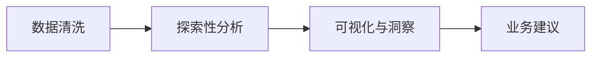
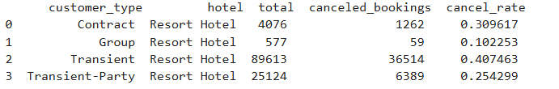

# 🏨 酒店预订需求分析  
**基于12万条预订数据的用户行为洞察 | Python/SQL/Tableau**  

---

## 📌 项目概述  
**目标**：分析酒店预订数据中的用户行为模式，定位高取消率订单特征，为优化定价策略与资源管理提供数据支持。  
**关键成果**：  
- 识别提前预订天数>100天的订单取消率高达40%，提出动态定价策略；  
- 发现合同订单和短期订单取消率高，建议引入定金制度；  
- 设计交互式Tableau看板。  

---

## 🛠️ 技术栈  
- **数据分析**：Python (Pandas, Matplotlib, Seaborn)  
- **数据查询**：SQL  
- **可视化**：Tableau, Plotly  

---

## 📂 数据来源  
Kaggle公开数据集：[Hotel booking demand](https://www.kaggle.com/datasets/jessemostipak/hotel-booking-demand)  
- **数据量**：119,390条记录，32个字段  
- **关键字段**：  
  - `is_canceled`（是否取消）  
  - `lead_time`（提前预订天数）  
  - `customer_type`（客户类型）  
  - `arrival_date_month`（入住月份）  

---

## 🔍 分析流程  

---

## 1. 数据清洗
  - 替换缺失值和不规范值
  - 删除入住人数为0的行

---

## 2. 数据分析

### 不同客户类型的取消率

  
   
  <em>合同订单（Contract）和短期(Transient)订单取消率高</em>

### 提前预订天数与取消率的关系

  
   
  <em>提前预订超过100天的订单取消率显著上升</em>

### 月度平均客流量对比（城市酒店 vs 度假酒店）

  
   
  <em>季节性需求不稳</em>

---

## 💡 业务建议

 
| 问题      | 策略                     |
|---------|--------------------------|
| 高取消率    | 动态梯度定价 + 超早鸟优惠  |
| 合同订单风险  | 定金制度（预付30%）  |
| 季节性需求不均 | 淡季“连住3晚免1晚”活动    |

